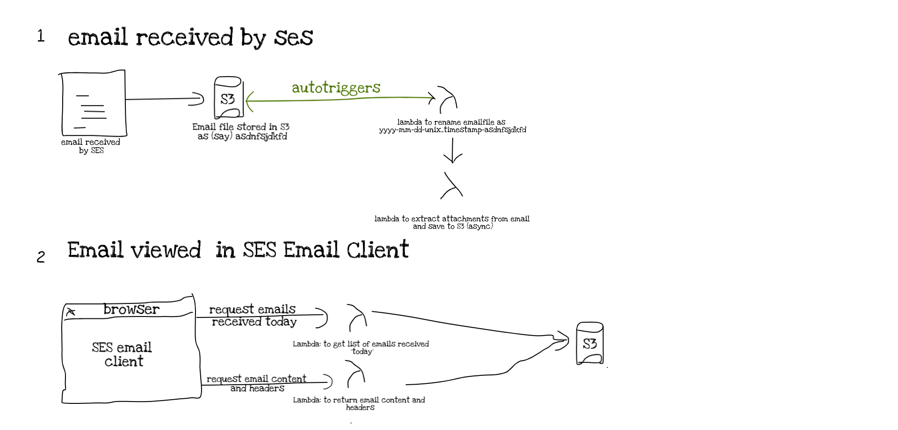

# SES Templates
In addition to giving you unlimited email ids on your own domain backed by the world class AWS ecosystem, I have also added support for a neat little feature which lets you view your SES templates directly in the browser.

The code is located inside /templates. Here are some screenshots -


# SES Email Client

Since AWS SES does not natively provide an email client to read emails neither does it provide IMAP which would let you use a mail client like Thunderbird, I decided to spin up my own email reader just for SES.

*A note on verbiage: below you will find references to **emails*, *email files**, and **eml files**. An email is basically a text file sitting somewhere. Therefore, all three words refer to the what you would commonly call an email. I have tried to minimize confusion where possible but if you find yourself not understanding some of the content in this readme, feel free to raise an issue.*


## The Problem

I have a domain (example.com) with it's MX records configured to point to AWS SES. Being a transactional email service provider, SES does not provide a client to read emails. 

This is proving to be a challenge for someone like me who is using SES for non-business purposes.

### My Hack

To get around the issue of SES not providing an email client, I forward emails sent to example.com to an email inbox which does have a client - like gmail. 

To be honest, this feels wrong. On the one hand, I set up my own email to avoid using google's products and on the other, I am using a google product (gmail) to read my emails. 

Additionally, the entire purpose to moving away from Google - i.e. to avoid giving them my data - is lost when I use their gmail client to read my emails.

## The Solution

SES Email Client is the v0.0.1 of a client for SES!

## The Architecture 

Before I started working on email-magicker, the lay of the land of my email set up was as follows:

1. S3 - all emails received by SES on my behalf are deposited into an S3 bucket with a specific prefix. So, emails sent to example.com go into <BUCKET_NAME>/example.com. Emails are of **.eml** format
2. SNS - When an email is received by SES, I fire off a notification to a different email account I own to let me know that an email was received.
3. Auto-forward - I use [this github project](https://github.com/arithmetric/aws-lambda-ses-forwarder) to forward emails to my gmail inbox

After implementing ses-email-client, my architecture has evolved a little. The overview is as below.


### New Lambdas Functions

#### Rename email (.eml) file name: 

AWS does not provide a way to filter S3 files so it is impossible to query S3 for the most recently received emails. This is because the email files are have long random alphanumeric names which don't follow any logical and discernable sort ordering. 

To get around this limitation and to make it easier to query S3 for emails received on or after a certain date, I added a lambda function which pre-pends the email receipt date in following format ```yyyy-mm-dd-unix_epoch-```. So, if email with eml file name abcdefghijklmno1234567890zzz was received on June 26th at 10:00 AM, I rename that file to ```2020-06-26-1593165600-abcdefghijklmno1234567890zzz```. 

To further normalize the new file name, I use UTC year, month, and date.

#### Emails received today 

This lambda function returns a list of emails file names (after conversion as described above) received ```today```. Keep in mind that I use UTC time to make it possible to filter emails by date. 

Obviously, it should be quite straightforward to filter by a different receipt date. 

API Gateway integration: This lambda is integrated with API Gateway and is protected using an API Key. The endpoint is `/email/today`.

Sample usage: *GET /email/today?domain=example.com*

#### Email headers and content

My final Lambda returns the headers and content of a specific email. 

API Gateway integration: This lambda is integrated with API Gateway and is protected using an API Key. The endpoint is `/email`. 

Sample usage: *GET /email?domain=example.com&id=2020-06-26-1593165600-abcdefghijklmno1234567890zzz&type=html*

### Email UI

Obviously, I can't be building an email client without, well, building a UI which is ```email/index.html```.

This client uses Foundation CSS, axios, and Vuejs to 
1. authenticate the user using AWS Cognito. Force log in if the user is not logged in.
2. read the domain for which the user wants to retrieve emails from the website URL
3. retrieve the list of emails (up to 100 emails) received today
4. retrieve the content of each email
5. display email subject on the screen
6. when the user clicks on the an email, show the email content


> Written with [StackEdit](https://stackedit.io/).
